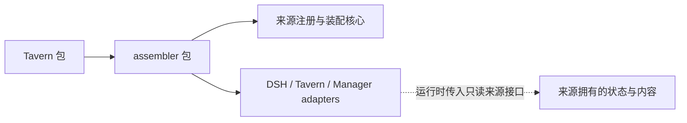

# DSH Prompt Assembler

[English](README_en.md) · [接入合同](docs/INTEGRATION.md)

独立的提示词装配库，针对 DSH `0.2.0-rc.2` 的请求装配协议 1。它不依赖 Tavern 或 Memory Manager npm 包。来源注册、位置、角色、深度、快照、工具事务与 system 完整快照由 assembler 管理；内容、存储、解析语法和读取权限由来源拥有。

这是本地候选包 `dsh-prompt-assembler@0.1.0`，尚未发布到 npm/GitHub。可直接安装提供的 tgz；Tavern 组合包需同时安装两个 tgz。原生 DSH rc.2 没有装配钩子，应用策略仍需准备核心扩展；不安装扩展时可以编辑、预览，不能声称支持真实请求装配。

```sh
npm install /path/to/dsh-prompt-assembler-0.1.0.tgz
```

作为库使用，无需 Tavern：

```js
import { createDshRegistry, assembleRequestAsync, BUILTINS } from 'dsh-prompt-assembler'
const registry = createDshRegistry()
const result = await assembleRequestAsync({ registry, preset: BUILTINS[0], nativeMessages, inputIds })
```

[第三方示例](docs/examples/notes.js) 同时实现动态内容和用户手填内容解析，完整验收位于 `test/integration.test.mjs`。adapter 维护在本仓库 `adapters/`，第三方通过 fork 或 PR 添加；新 adapter 不应要求核心识别第三方来源 ID，不在未选择来源时自动注入内容。



实线表示代码/包依赖；虚线表示 adapter 调用来源传入的公开接口。assembler 的 adapter 接收 Tavern/Manager 的服务对象，不通过 npm 引入它们，因此没有反向包依赖。React 仅为可选 UI peer，使用 Host 核心不需要 React。`src/client.js` 提供可组合视图，调用方注入 fetch、语言、刷新事件与可选 Trace URL；HTTP handler 必须放在调用方已经认证、检查同源/desktop 令牌的路由边界内。

开发与打包：在 Tavern 源码的 `.local/dsh-prompt-assembler` 中放置此独立 checkout，执行 Tavern 的 `npm ci`。`.local` 不属于 Tavern 仓库或其 npm 发布内容。`node scripts/pack-with-assembler.mjs --assembler .local/dsh-prompt-assembler --output .local/packages` 生成可一起安装的两个包，Tavern 发布包中的依赖改用精确版本 `0.1.0`，不会包含本地 checkout 路径。正式发布后应把 Tavern 源码依赖也改成 npm 版本并重新生成 lockfile；当前不假称包已发布。

[核心扩展准备工具](scripts/prepare-request-assembly.mjs) 只生成独立输出，不修改 DSH 安装或来源 checkout。运行安装/替换核心前须停止并备份目标测试环境。

开发测试在独立源码仓库内执行 `npm ci` 与 `npm run check`。生成核心扩展同样在该源码仓库执行，使用开发依赖 esbuild：`node scripts/prepare-request-assembly.mjs <DSH-source> <separate-output>`。纯运行时安装不需要 esbuild。库可运行于 Node >=20；真实 DSH rc.2 Host 要求 Node ^22.19.0 或 >=24。
