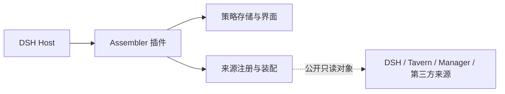

# DSH Prompt Assembler

[English](README_en.md) · [安装](docs/INSTALLATION.md) · [来源接入合同](docs/INTEGRATION.md) · [安全边界](SECURITY.md)

`dsh-prompt-assembler` 0.2.0 是面向 **DSH `0.2.0-rc.2`** 的独立提示词装配插件，也提供可组合的装配库。插件自己管理策略存储、来源注册、请求钩子、安全 API 和界面；无需安装 Tavern 或 Memory Manager。来源继续拥有正文、资源、解析语法与读取权限，DSH durable history 继续作为会话历史的权威记录。

## 安装与使用

真实 DSH Host 需要 Node **`^22.19.0 || >=24`**；纯装配库需要 Node **`>=20`**。

```sh
dsh plugin --profile web add github:Player-MINEPIG/dsh-prompt-assembler#main
```

该仓库目前为私有仓库，安装需要已获授权的 GitHub 访问。此命令不是公开插件目录或 npm 发布的声明。插件通过 `dsh.bundle` 加载 `cordis.patch.yml`，通过 `dsh.client` 加载提交在仓库中的 `dist/client.js`；安装时不编译客户端源码。

在侧栏打开“当前会话”的装配界面，包括第一条消息之前的空白会话；策略库也始终可从侧栏打开。选择已有会话并应用策略，或在策略库用该策略创建会话：创建操作先绑定策略，再打开新会话。已存在的会话标题入口可作为快捷方式。没有全局默认策略，也不会因安装插件或注册来源而隐式应用策略。

**应用到真实请求还需要请求装配协议 1。** Stock DSH `0.2.0-rc.2` 没有该钩子；必须显式运行并审阅 [核心准备工具](scripts/prepare-request-assembly.mjs) 的独立输出，再在目标运行环境安装准备后的核心。插件安装不会悄悄修改 DSH 核心。缺少能力时，编辑和只读预览可用，应用策略会返回 HTTP 409（`REQUEST_ASSEMBLY_CORE_REQUIRED`）。详见[安装说明](docs/INSTALLATION.md)。

## 来源与第三方扩展



插件公开 Host 服务 `dshPromptAssembler`，提供 `store`、`runtime`、`registry`、`attachTavern(options)` 和 `migrateLegacy(root)`；共享来源服务为 `dshPromptSources`。Tavern adapter 接收来源拥有的公开只读对象，assembler 不依赖 Tavern/Manager 包或其内部文件。第三方用现有 registry API 注册动态模块或自定义文本解析器，无需修改装配核心；未选择的来源不会自动注入。

[来源接入合同](docs/INTEGRATION.md) 和[运行示例](docs/examples/notes.js)说明注册、取消、读取租约、预览和来源卸载的行为。装配快照保留完整请求内容与 provenance；来源卸载后不会改写 DSH 原生历史。迁移旧 `assembly-presets.json` 保留原文件与旧 mode scope，由 assembler 自己的存储接管后续修改。卸载插件保留 DSH durable history 和策略存储。

## 作为库组合

```js
import { createDshRegistry, assembleRequestAsync, BUILTINS } from 'dsh-prompt-assembler'
const registry = createDshRegistry()
const result = await assembleRequestAsync({ registry, preset: BUILTINS[0], nativeMessages, inputIds })
```

根导出保持可组合库 API。DSH loader 的 package `main` 为 `src/plugin.js`，`dsh-prompt-assembler/plugin` 是显式 Host 插件入口，`dsh-prompt-assembler/plugin-client` 是浏览器入口。`src/client.js` 仍提供可嵌入视图；自行组合 HTTP factory 的调用方须负责认证和安全 fetch。

## 开发与验证

```sh
npm ci
npm run check
```

`check` 覆盖本地测试、客户端构建与包内容检查。CI 在库支持的 Node 版本执行上述命令。真实 Host 测试需显式提供准备后的 rc.2 核心；默认测试的跳过项不代表 Host 或浏览器验收通过，详见[验证说明](docs/INSTALLATION.md#验证)。当前版本见[变更记录](CHANGELOG.md)。
