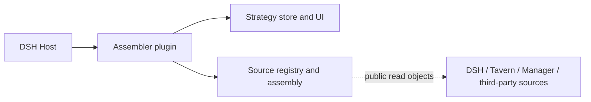

# DSH Prompt Assembler

[中文](README.md) · [Installation](docs/INSTALLATION_en.md) · [Usage](docs/USAGE_en.md) · [Source integration contract](docs/INTEGRATION_en.md) · [Security boundaries](SECURITY_en.md)

`dsh-prompt-assembler` 1.1.0 is a standalone prompt assembly plugin for **DSH `0.2.0-rc.2`**, with composable library APIs. The plugin owns its strategy store, registry, request hook, secure API and UI. [Tavern](https://github.com/Player-MINEPIG/dsh-tavern) and [Memory Manager](https://github.com/Player-MINEPIG/dsh-memory-manager) are optional sources. Sources retain ownership of content, resources, syntax and read permissions; DSH durable history remains authoritative for session history.

## Quick start

Start with a working DSH **`0.2.0-rc.2`** Host using Node **`^22.19.0 || >=24`**. This walkthrough uses Standard mode and requires no Tavern, Memory Manager or core addon.

1. Stop the target Host and install the plugin. Replace `web` with your profile name:

   ```sh
   dsh plugin --profile web add github:Player-MINEPIG/dsh-prompt-assembler#v1.1.0
   ```

2. Restart the Host, open a session, then go to **Settings → Prompt assembly**. A blank session before its first message also works.
3. Click **Create** in the strategy library, enter a name and choose **Standard · public interfaces** as the backend. Keep Native instructions, Native history and Current input enabled. Expand **Source, text and delivery settings**, select the “DSH custom text” parser and click **Add custom text**. For example, enter “Keep your answers concise.” and keep the role as `user`.
4. Click **Assembly result** to check content, roles and order. Preview sends no request and excludes pending composer input.
5. Click **Save and apply to this session**, confirm that “Applied” shows your strategy, then return to chat and send a message. To start a new session instead, use **Create a session with this strategy** and choose a workspace; the strategy is bound before the session opens.

**Save rules** only updates the library; reapply changes to affect subsequent requests. Installation does not apply a strategy, and there is no global default. See [usage](docs/USAGE_en.md) for the full workflow and the [known limitation](docs/HISTORY_POLICY_en.md#official-trajectory-display-limitation) for standard cleanup's trajectory display behavior.

`#v1.1.0` pins this version; use `#main` to follow development. See [installation](docs/INSTALLATION_en.md) for other options and advanced setup. The repository is public, which does not establish npm publication or a plugin-directory listing. `dsh.bundle` loads `cordis.patch.yml`; `dsh.client` loads the committed `dist/client.js`, without compiling client source on installation. Advanced strategies require the optional addon and prepared protocol-1 core; missing either returns 409. See [backend behavior](docs/BACKENDS_en.md). Library-only use requires Node **`>=20`**.

## Sources and third-party extensions



The Host service `dshPromptAssembler` exposes `store`, `runtime`, `registry`, `strategies`, `registerPresets(definition)`, `attachTavern(options)` and `migrateLegacy(root)`. Shared source registration uses `dshPromptSources`; ordering uses `dshPromptStrategies`. The Tavern adapter receives source-owned public read objects; the assembler has no Tavern/Manager package dependency and does not import their internals. Third parties register dynamic modules or custom text parsers through the existing registry API. Unselected sources do not inject content.

The [integration contract](docs/INTEGRATION_en.md) and [runnable example](docs/examples/notes.js) describe registration, cancellation, read leases, preview and source removal. Advanced assembly snapshots retain full request content and provenance; standard mode uses native events and body references. Removing a source does not rewrite native DSH history. Migration of legacy `assembly-presets.json` preserves the original file and old mode scopes; subsequent edits belong to the assembler store. Uninstalling preserves DSH durable history and strategy storage.

## Compose the library

```js
import { createDshRegistry, assembleRequestAsync, BUILTINS } from 'dsh-prompt-assembler'
const registry = createDshRegistry()
const result = await assembleRequestAsync({ registry, preset: BUILTINS[0], nativeMessages, inputIds })
```

Root exports retain composable library APIs and also export the Host plugin’s `name`, `inject` and `apply` for DSH package-exports loading. Package `main` is `src/plugin.js`; `dsh-prompt-assembler/plugin` explicitly exports the Host plugin and `dsh-prompt-assembler/client` exports the browser entry. `dsh-prompt-assembler/panel` still offers an embeddable view. Callers composing the HTTP factory provide authentication and secure fetch.

## Develop and verify

```sh
npm ci
npm run check
```

`check` covers local tests, client building and package checks. CI runs these commands on supported library Node versions. Real Host checks explicitly select stock rc.2 for native behavior and prepared rc.2 plus the addon for advanced behavior. Skipped default tests do not establish Host or browser acceptance; see [verification](docs/INSTALLATION_en.md#verification). See [version history](CHANGELOG.md) for current changes.

[Third-party guide](docs/DEVELOPER_GUIDE_en.md) · [HTTP API](docs/API_en.md) · [Architecture](docs/ARCHITECTURE_en.md).

See the [developer guide](docs/DEVELOPER_GUIDE_en.md#register-ordering-strategies-and-preset-catalogs) for third-party ordering algorithms, slot sources and revocable preset catalogs. Built-in and extension algorithms use the same registry.
