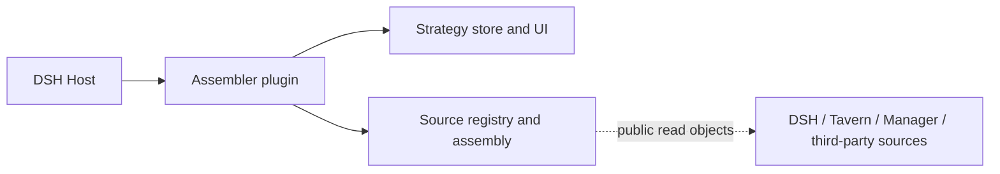

# DSH Prompt Assembler

[中文](README.md) · [Installation](docs/INSTALLATION_en.md) · [Usage](docs/USAGE_en.md) · [Source integration contract](docs/INTEGRATION_en.md) · [Security boundaries](SECURITY_en.md)

`dsh-prompt-assembler` 0.2.0 is a standalone prompt assembly plugin for **DSH `0.2.0-rc.2`**, with composable library APIs. The plugin owns its strategy store, registry, request hook, secure API and UI. Tavern and Memory Manager are optional sources. Sources retain ownership of content, resources, syntax and read permissions; DSH durable history remains authoritative for session history.

## Install and use

An actual DSH Host requires Node **`^22.19.0 || >=24`**. The core library requires Node **`>=20`**.

```sh
dsh plugin --profile web add github:Player-MINEPIG/dsh-prompt-assembler#main
```

The repository is currently private; installation requires authorized GitHub access. This command does not imply a public listing or an npm publication. `dsh.bundle` loads `cordis.patch.yml`; `dsh.client` loads the committed `dist/client.js`. Installation does not compile client source.

Open current-session assembly from the sidebar, including a blank session before its first message. The strategy library is also always available from the sidebar. Apply a strategy to an existing session, or create a session using a library strategy: creation binds the strategy before opening the session. There is no global default strategy; installing the plugin or registering a source does not implicitly apply one.

**Actual requests also require request assembly protocol 1.** Stock DSH `0.2.0-rc.2` lacks this hook. Explicitly run and review the separate output from the [core preparation tool](scripts/prepare-request-assembly.mjs), then install the prepared core into the intended runtime. Plugin installation never silently modifies DSH core. Without the capability, editing and read-only preview work; applying a strategy returns HTTP 409 (`REQUEST_ASSEMBLY_CORE_REQUIRED`). See [installation instructions](docs/INSTALLATION_en.md).

## Sources and third-party extensions



The Host service `dshPromptAssembler` exposes `store`, `runtime`, `registry`, `attachTavern(options)` and `migrateLegacy(root)`. Shared source registration uses `dshPromptSources`. The Tavern adapter receives source-owned public read objects; the assembler has no Tavern/Manager package dependency and does not import their internals. Third parties register dynamic modules or custom text parsers through the existing registry API. Unselected sources do not inject content.

The [integration contract](docs/INTEGRATION_en.md) and [runnable example](docs/examples/notes.js) describe registration, cancellation, read leases, preview and source removal. Assembly snapshots retain full request content and provenance; removing a source does not rewrite native DSH history. Migration of legacy `assembly-presets.json` preserves the original file and old mode scopes; subsequent edits belong to the assembler store. Uninstalling preserves DSH durable history and strategy storage.

## Compose the library

```js
import { createDshRegistry, assembleRequestAsync, BUILTINS } from 'dsh-prompt-assembler'
const registry = createDshRegistry()
const result = await assembleRequestAsync({ registry, preset: BUILTINS[0], nativeMessages, inputIds })
```

Root exports retain composable library APIs and also export the Host plugin’s `name`, `inject` and `apply` for DSH package-exports loading. Package `main` is `src/plugin.js`; `dsh-prompt-assembler/plugin` explicitly exports the Host plugin and `dsh-prompt-assembler/client` exports the browser entry. `dsh-prompt-assembler/panel` still offers an embeddable view. Callers composing the HTTP factory provide authentication and secure fetch.

## Develop and verify

```sh
npm ci
npm run check
```

`check` covers local tests, client building and package checks. CI runs these commands on supported library Node versions. Real Host checks require an explicitly supplied prepared rc.2 core. Skipped default tests do not establish Host or browser acceptance; see [verification](docs/INSTALLATION_en.md#verification). See [version history](CHANGELOG.md) for current changes.
