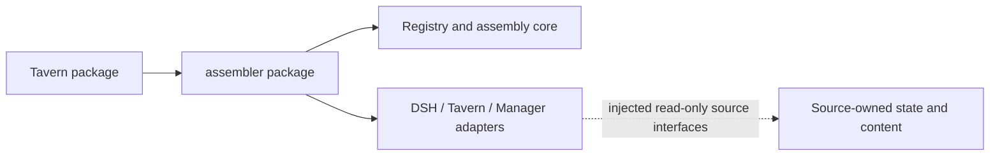

# DSH Prompt Assembler

[中文](README.md) · [Integration contract](docs/INTEGRATION_en.md)

An independent request assembly library targeting DSH `0.2.0-rc.2`, request assembly protocol 1. It has no npm dependency on Tavern or Memory Manager. The assembler owns registration, placement, roles, depth, retention, tool transactions and complete system snapshots. Sources own content, storage, language and read permissions.

`dsh-prompt-assembler@0.1.0` is a local candidate, not a published npm/GitHub release. Install the provided tarball. Install both tarballs for the Tavern combination. Stock DSH rc.2 has no assembly hook: applying a strategy still requires the prepared core extension. Editing and previewing alone do not establish actual request support.

```sh
npm install /path/to/dsh-prompt-assembler-0.1.0.tgz
```

Standalone library usage:

```js
import { createDshRegistry, assembleRequestAsync, BUILTINS } from 'dsh-prompt-assembler'
const registry = createDshRegistry()
const result = await assembleRequestAsync({ registry, preset: BUILTINS[0], nativeMessages, inputIds })
```

The [third-party example](docs/examples/notes.js) implements dynamic content and source parsing of user-authored text. Its acceptance tests are in `test/integration.test.mjs`. Adapters belong in this repository's `adapters/` directory; contributors extend them through forks or PRs. An adapter must not require the core to recognize its source ID or inject unselected content.



Solid arrows are code/package dependencies. The dashed arrow is a runtime call to an injected public interface. Adapters receive Tavern/Manager services, without importing their npm packages. React is an optional UI peer. The reusable React view accepts fetch, locale, refresh event and optional Trace URL. The HTTP handler must be mounted behind the caller's existing authentication, origin and desktop-token checks.

For source development, place this independent checkout at Tavern's `.local/dsh-prompt-assembler`, then run Tavern's `npm ci`. It is excluded from the Tavern repository and npm package. `node scripts/pack-with-assembler.mjs --assembler .local/dsh-prompt-assembler --output .local/packages` builds two installable packages. The packaged Tavern dependency uses exact version `0.1.0`, without a checkout path. After publishing, change the source dependency to the npm version and regenerate the lockfile; no publication is claimed here.

The [core preparation tool](scripts/prepare-request-assembly.mjs) generates separate output and never modifies a DSH installation or source checkout. Stop and back up the intended test runtime before installing a core replacement.

Run `npm ci` and `npm run check` inside the independent source checkout for development tests. Generate the core extension there using the esbuild development dependency: `node scripts/prepare-request-assembly.mjs <DSH-source> <separate-output>`. Library runtime installation does not require esbuild. The library requires Node >=20; an actual DSH rc.2 Host requires Node ^22.19.0 or >=24.
